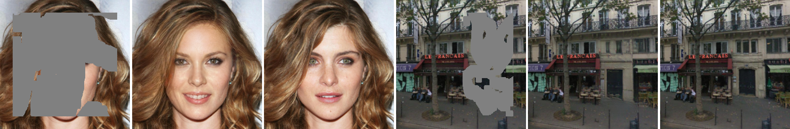

# DCDPI


[**Paper**](https://link.springer.com/article/10.1007/s00371-023-03045-z)

**Dynamic context-driven progressive image inpainting with auxiliary generative units**<br>

_Zhiwen Wang, Kai Li, Jinjia Peng_<br>
In The visual Computer (2023)

### Prerequistes

- Python >= 3.6
- PyTorch >= 1.0

## Getting Started

### Installation

- Clone this repository:

```
git clone https://github.com/slowwords/DCDPI.git
cd DCDPI
```

- Install PyTorch and dependencies from [http://pytorch.org](http://pytorch.org/)
- Install python requirements:

```
pip install -r requirements.txt
```
### Datasets

**Image Dataset.** We evaluate the proposed method on the [CelebA](http://mmlab.ie.cuhk.edu.hk/projects/CelebA.html) and [Paris StreetView](https://github.com/pathak22/context-encoder) datasets, which are widely adopted in the literature. 

**Mask Dataset.** Irregular masks are obtained from [Irregular Masks](https://nv-adlr.github.io/publication/partialconv-inpainting) and classified based on their hole sizes relative to the entire image with an increment of 10%.

### Training

To train the model, you run the following code.

```
python train.py \
  --image_root [path to image directory] \
  --mask_root [path to mask directory] \
  --pre_trained [path to checkpoints]
```

### Testing

To test the model, you run the following code.

```
python test.py \
  --pre_trained [path to checkpoints] \
  --image_root [path to image directory] \
  --mask_root [path to mask directory] \
  --result_root [path to output directory] \
  --number_eval [number of images to test]
```

## Citation

If any part of our paper and repository is helpful to your work, please generously cite with:

```
@article{Wang_2023_TVCJ,
  title={Dynamic context-driven progressive image inpainting with auxiliary generative units},
  author={Wang, Zhiwen and Li, Kai and Peng, Jinjia},
  journal={The Visual Computer},
  pages={1--16},
  year={2023},
  publisher={Springer}
}
```
